# Messaging v2 API Account Setup (UI) {#top}

This walks through the steps to configure your Bandwidth Phone Number Dashboard and Messaging API to work together.
This guide is entirely focused on setup with the UI.  If you'd like to follow along with the API, head to the [via API](apisetup.md) to follow along there.

## Before we get started

1. Have you downloaded [Postman](https://www.getpostman.com/) or have the ability to make an API request?
* Postman is an app for easy RESTful API exploration.
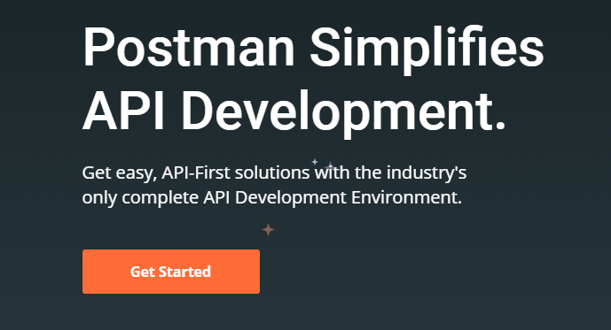
* In this guide, we will use Postman to send messages using our new application.
* Once you’ve downloaded Postman and created an account (if you don’t already have one), fill out the form on the [Postman](postman.md) page to download the Messaging 2.0 collection of APIs.

* In order to fill out this form, you’ll need several pieces of information that can be located in the Bandwidth Dashboard.
  * *Username* and *password*
    * These are your credentials to log into the Bandwidth Dashboard
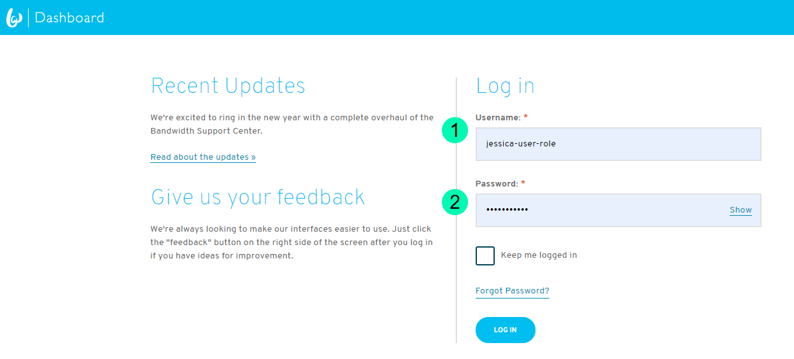
  * *Account ID*
    * Once logged into the Dashboard, click on the Account menu to locate your Account ID at the top of the Account Overview section
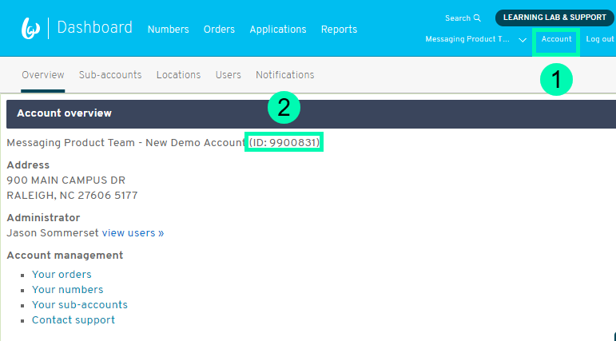
  * *SubAccount*
    * If you have an existing Sub-Account, from the Account Overview screen (screenshot above) click “Sub-accounts” from the menu bar.
      * Click “manage sub-account” for the Sub-Account you will use for this Application
      * You will see the ID for the sub-account at the top of this screen. Enter this ID into the Postman form.
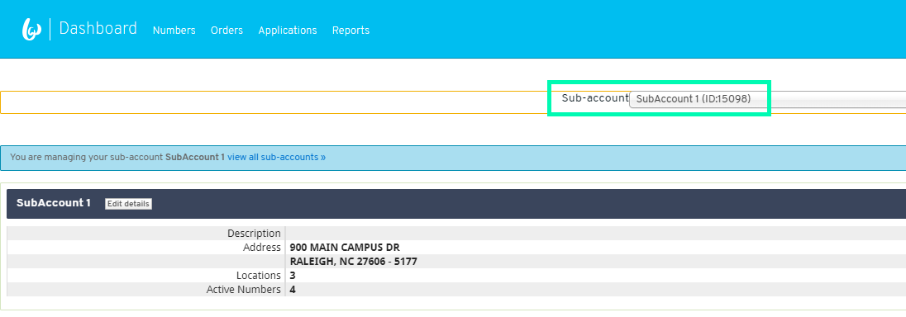
    * If you don’t have a Sub-Account, or want to create a new one for this specific Application, click the Learning Lab & Support link in the dashboard and select the “Create a Sub-Account” guide.

  * Messaging [API Token and Secret](https://support.bandwidth.com/hc/en-us/articles/360014110974-How-to-Create-API-Tokens-Secrets-V2-)
    * Bandwidth APIs use BASIC HTTP Authentication. You will need to have your account ID, token, and secret to make API calls.
    * You may already have a Token and Secret that you can enter into the Postman form, but if you need a new set of credentials, you’ll need to follow the steps below.
    * In the Dashboard, navigate to the Applications menu. In the top right of your screen, you’ll see a link for API credentials
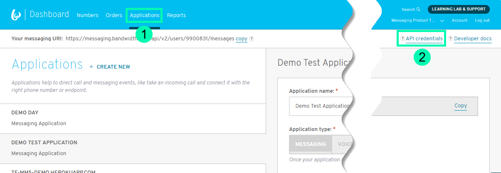
    * Click the button to CREATE NEW and then copy the credentials into a safe place for future use. Token and Secret pairs will not be visible after you leave this screen.
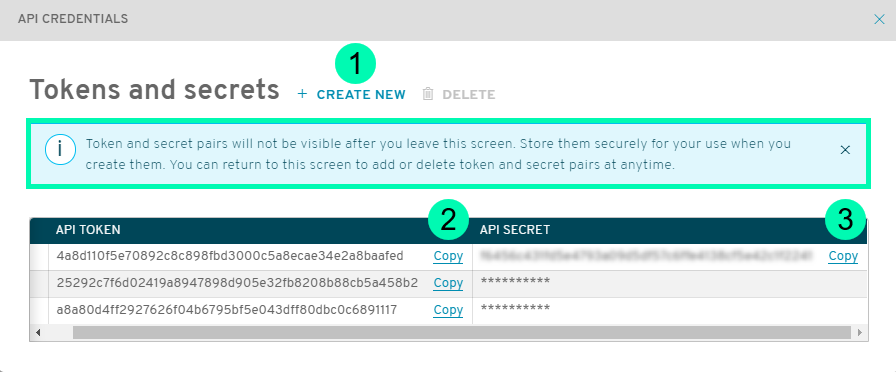
2. Once you’ve gathered all the information needed to complete the [Postman Collection form](postman.md), Click the “Run in Postman” button at the bottom of the page. 
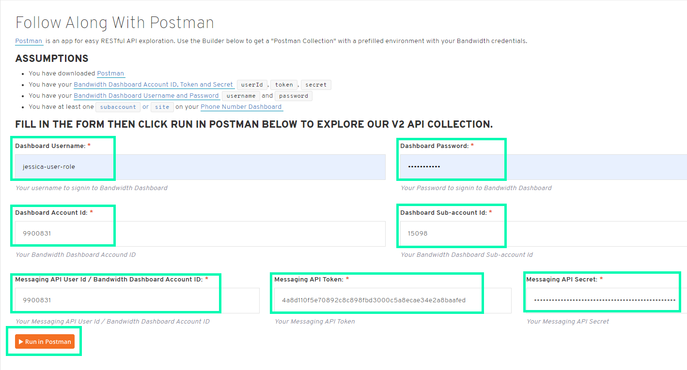
3. The collection should now appear in Postman when you toggle to the Collections tab.

## Create an Application
Now that we’ve taken care of the prerequisites, we’re ready to create an Application. Start by clicking the Applications menu in the dashboard.
* Create New 
* Enter your Application name
* Your Application ID is created for you
* Enter your Callback URL (this is the URL of your server)
* Create Application

* Once you’ve created your Application, we’ll need to associate it with a Location. If you have an existing Location, you’ll choose the “Associate a location with this application” link; if not, you’ll need to click the link to “Create a location.”
  * If you’d like to follow along with a Quick Start guide for setting up a Location, you can use the Learning Lab & Support link to follow the “Create a Location” guide.
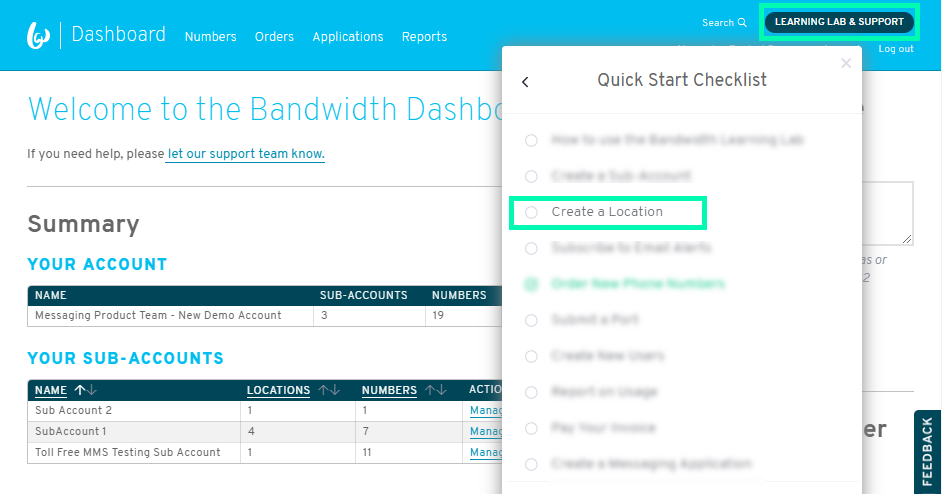
  * When creating a Location, Select the Sub-account that the Location will be associated with and enter a name for your Location.
  * Select the SMS and MMS settings appropriate for your account.
  * When selecting HTTPV2 Messaging (if your SMS Protocol is HTTP), you will need to use the drop down to assign the Application we just created to this Location.
  * After selecting all of the appropriate settings for your Location, click Submit.

## Order Phone Numbers
* Now that we’ve done all the set up work for our application, we need to order a phone number to use to send text messages.
* In the Dashboard, use the Learning Lab & Support link to find the Quick Start guide for “Order New Phone Numbers.”

* Follow along with the guide and once your order/purchase has been completed, you will land on the page below. Click the order ID to open the order. 
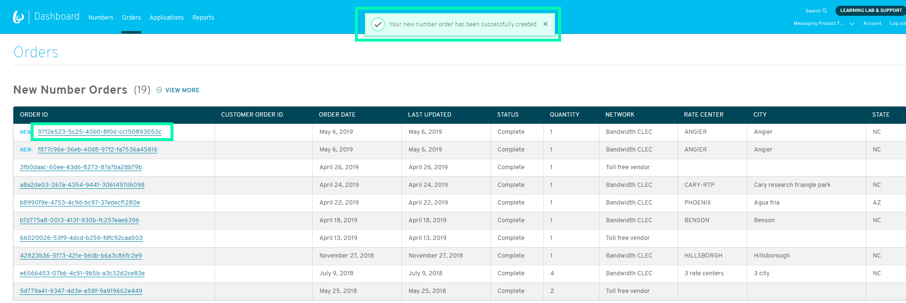
* Scroll down the page till you see the number you ordered and use the Copy to Clipboard button to grab the number. This is the number you will use to send and receive messages with your Application.
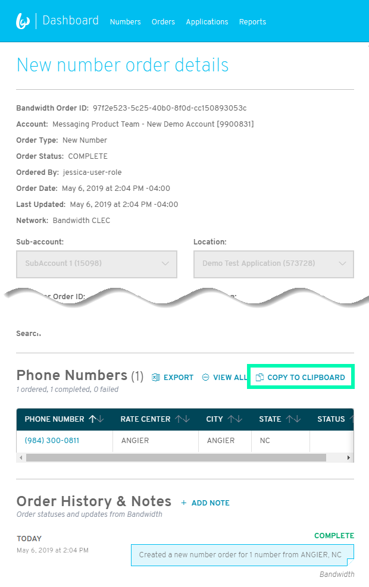

## Sending Messages
* At this point you should have completed the following:
  * Downloaded Postman and filled out the Postman Collection form with your individual credentials and potentially created a Sub-Account and Location in this step.
  * Created an Application
  * Ordered number(s)
* Let’s head over to Postman and see what it looks like to actually send a message.
* Open Postman and toggle over to Collections. Use the drop down to open the Bandwidth Messaging 2.0 Collection and then click Send Text Messages.
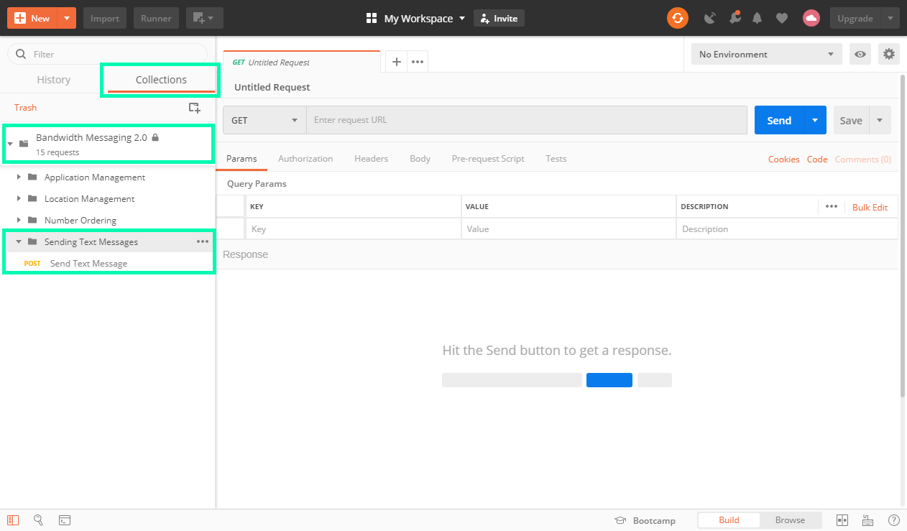
* Click “POST Send Text Message” and then click into the Authorization tab.
  * Confirm your Token and Secret are entered here for your Username and Password.
* Now let’s move over to the Body tab in Postman.
  * Enter the following information then click the Send button:
    * *From*: The number we ordered in the previous section of the guide.
    * *To*: The number you’re sending a message to.
    * *Text*: Update with the message you want to send
    * *ApplicationID*: From your Application in the Dashboard

  * You should see a Status of 202 Accepted and a message completed to the receiving party.

### Message Parameters
Parameters for sending a message can be found [here](methods.createMessage.md)

## Related Links
* [How to Download Message Detail Records (MDRs)](https://support.bandwidth.com/hc/en-us/articles/226661127-How-to-Download-Billing-Detail-Records-BDRs-and-Message-Detail-Records-MDRs-)
* [Message Detail Record (MDR) Field Descriptions](https://support.bandwidth.com/hc/en-us/articles/360009991954)
